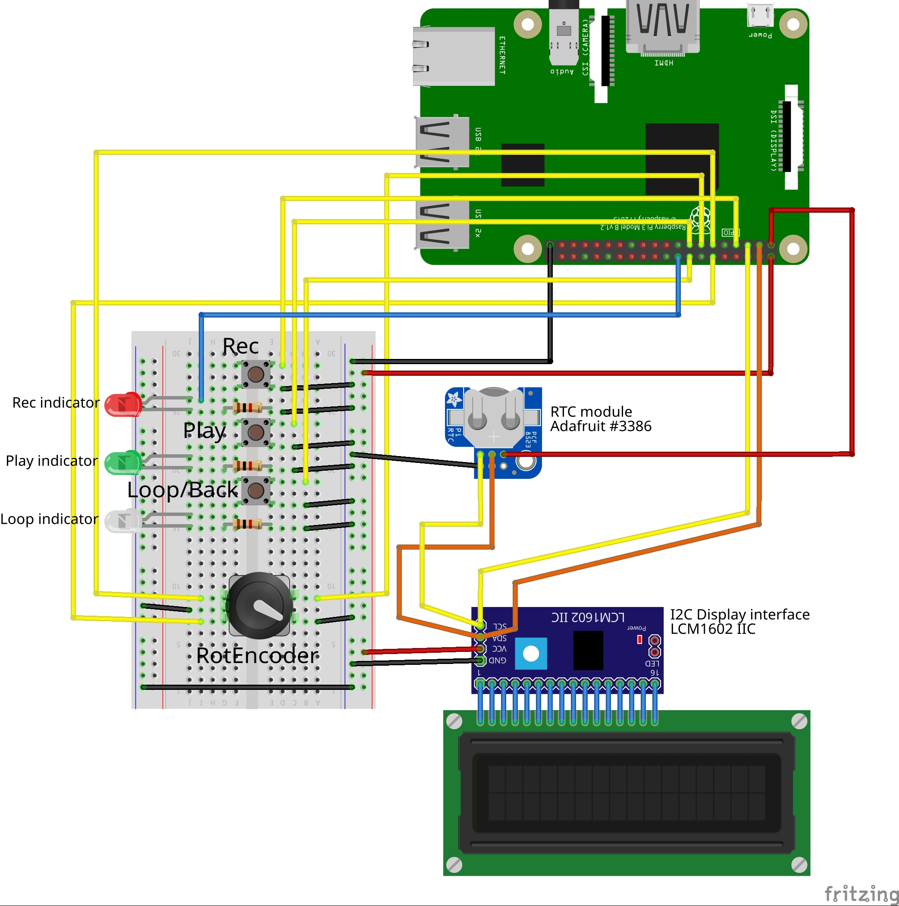

# A recording box for USB microphones and audio interfaces

## List of materials

- Raspberry Pi 3
- 3 push buttons (1 momentary and 2 on/off switches)
- 3 LEDs and resistors
- real Time Clock module
- LCD Display (20x4 characters)
- an adequate enclosure
- a USB microphone or USB sound card (with speaker out and mic in)
- some wire

## Basic schematic


## install required packages on a standard RaspberryPi Os lite
```
sudo apt-get update
sudo apt-get install python3-pip python3-pyaudio python3-smbus python3-gpiozero git 
sudo pip3 install RPLCD
```
