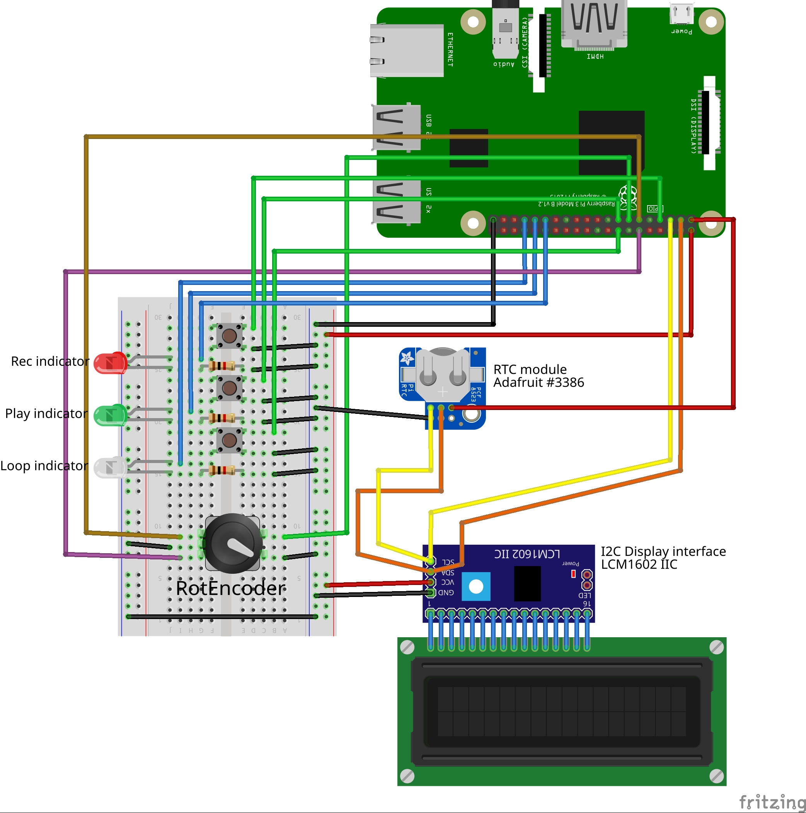

# A recording box for USB microphones and audio interfaces

## Overview

This small project is a audio recording box built from a Raspberry Pi and some basic components. 
Audio recording is possible via any USB microphone. For playback a USB sound card is recommended.
The goal is to have simple cassette recorder like functionality.

Features are

- direct recording with one button push
- a display with a basic menu to navigate through recordings and setup audio devices
- menu navigation is done with a rotary encoder with a built-in switch (push)
- playback can be started by navigating to a recorded file and pushing the play button
- a separate button can be used to set up a A/B loop for continuous playback.
- recorded files are named with a date and time stamp
- the RTC module keeps time and date when unplugged from power

## Hardware

### Bare minimum

- Raspberry Pi 3
- 3 push buttons (1 momentary: Loop, and 2 on/off switches: Rec and Play)
- 3 LEDs and resistors
- a rotary encoder with integrated push button (for menu navigation)
- LCD Display (20x4 characters) with I2C adapter
- a USB microphone or USB sound card (with speaker out and mic in)
- some wire

### Recommended parts

- real Time Clock module, e.g. [Adafruit PiRTC - PCF8523](https://www.adafruit.com/product/3386)
- sturdy push buttons, momentary and on/off with LED included (I used [this one](https://www.kiwi-electronics.nl/16mm-verlichte-drukknop-aan-uit-rood?search=16mm%20Verlichte%20Drukknop&description=true) in different colors)
- an adequate enclosure, e.g. a console like [this one](https://www.musikding.de/Console-enclosure-161x97-gray)
- a heat sink for the Raspberry Pi, possibly a small fan


## Basic schematic


## Software
### Basic setup for a freshly installed Raspberry Pi OS lite
Install the required packages:

```
sudo apt-get update
sudo apt-get install python3-pip python3-pyaudio python3-smbus python3-gpiozero git 
sudo pip3 install RPLCD
```
### Clone this repository
```
git clone https://github.com/lochbika/recording_box.git
```
### Configure some hardware
Make sure that the RTC module [is configured and working correctly](https://learn.adafruit.com/adding-a-real-time-clock-to-raspberry-pi/set-up-and-test-i2c) and add the following lines to /boot/config.txt:

```
dtparam=i2c_arm=on
dtoverlay=i2c-rtc,pcf8523
```

There is an example file at [RaspberryPi_config/config.txt](RaspberryPi_config/config.txt).

### Run it
Either log in via ssh and manually start it

```
python3 main.py
```

or modify and copy the [systemd service file](systemd/recording_box.service) to /etc/systemd/system, start and enable it:

```
sudo cp systemd/recording_box.service /etc/systemd/system/
sudo systemctl daemon-reload
sudo systemctl start recording_box.service
sudo systemctl enable recording_box.service
```
